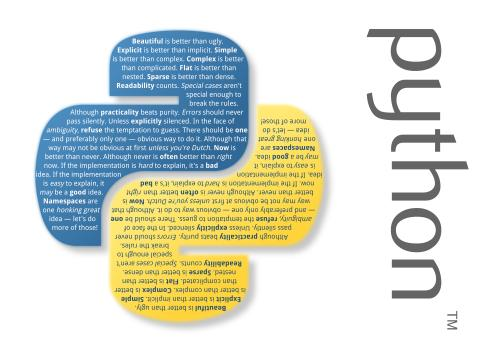

# Python
Python practice.

### 2019-06-20

- [5.4特征工程](./projects/handbook/05_4_1.py)

### 2019-06-17

- [sklearn数据集拆分](./projects/handbook/05_3_2.py)

### 2019-05-21

- [微信获取朋友全图](./script/wechat_friends.py)

### 2019-05-16

- [file_op.py](./script/file_op.py)
    file operation

### 2019-05-09

- 添加了[script](./script)
